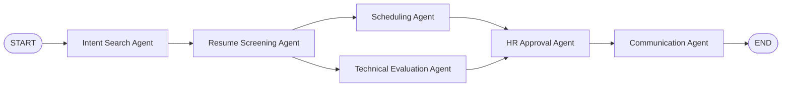

# 多智能体协作式招聘与简历挖掘系统说明

本文档说明本项目目前已经实现的能力、整体流程、关键文件结构，以及如何在本地运行和扩展。

## 1. 项目定位

本项目是一个基于 LangChain / LangGraph 思路实现的多智能体招聘自动化系统原型，目标是模拟一个端到端招聘工作流：

- 从岗位 JD 中识别招聘意图。
- 自动读取候选人简历。
- 按技能、经验、学历进行人岗匹配评分。
- 对合适候选人推荐面试时间。
- 为面试官生成技术面试 brief。
- 生成候选人邮件、面试官邮件和 HR 摘要。
- 在候选人真实外发前加入 HR 审批门禁。
- 在安装 LangGraph 后，支持在审批节点通过 checkpoint 暂停和恢复流程。

当前项目既可以在没有真实 LLM、没有 LangGraph 的情况下离线演示，也可以在安装完整依赖后接入真实 LangGraph、OpenAI 兼容模型、SMTP、SendGrid、飞书等服务。

## 2. 当前已经实现的能力

### 2.1 五类 Agent

项目目前实现了 5 个核心 Agent，并额外加入了一个 HR 审批节点：

| Agent | 文件 | 作用 |
| --- | --- | --- |
| Intent Search Agent | `src/recruitment_agents/agents.py` | 从岗位描述中提取岗位、技能、经验、学历、地点等招聘意图。 |
| Resume Screening Agent | `src/recruitment_agents/agents.py` | 解析简历，并按加权评分模型筛选候选人。 |
| Scheduling Agent | `src/recruitment_agents/agents.py` | 模拟跨时区可用时间推荐和冲突检测。 |
| Technical Evaluation Agent | `src/recruitment_agents/agents.py` | 为候选人生成技术面试重点、问题和风险提示。 |
| Communication Agent | `src/recruitment_agents/agents.py` | 生成通知邮件，并调用通知通道投递或写入草稿。 |
| HR Approval Agent | `src/recruitment_agents/agents.py` | 在真实外发候选人通知前进行人工审批门禁。 |

### 2.2 简历解析

简历解析逻辑在：

```text
src/recruitment_agents/parsers.py
```

当前支持的输入类型：

- `.txt`
- `.md`
- `.pdf`
- `.docx`
- `.doc`
- `.png`
- `.jpg`
- `.jpeg`
- `.webp`
- `.bmp`
- `.tiff`

其中 PDF、Word、图片 OCR 依赖 `requirements.txt` 中的可选库，例如 `pypdf`、`python-docx`、`pytesseract`、`pillow`。本地默认样例使用 TXT 简历，所以不装这些库也能跑通演示。

### 2.3 Pydantic 结构化状态

核心数据模型在：

```text
src/recruitment_agents/models.py
```

目前包含：

- `JobIntent`：岗位意图。
- `CandidateProfile`：候选人结构化信息。
- `ScoreBreakdown`：技能、经验、学历分项得分。
- `CandidateMatch`：候选人匹配结果。
- `InterviewRecommendation`：面试时间推荐。
- `TechnicalEvaluation`：技术面评 brief。
- `EmailNotification`：邮件通知。
- `ApprovalDecision`：HR 审批状态。
- `DeliveryResult`：通知投递结果。
- `RecruitmentState`：整个 LangGraph 工作流共享状态。

### 2.4 加权评分模型

评分逻辑在：

```text
src/recruitment_agents/scoring.py
```

当前评分权重：

| 维度 | 权重 |
| --- | --- |
| 技能匹配 | 60% |
| 经验匹配 | 30% |
| 学历匹配 | 10% |

推荐等级：

| 综合分 | 推荐等级 |
| --- | --- |
| >= 85 | `strong_match` |
| >= 70 | `match` |
| >= 55 | `backup` |
| < 55 | `reject` |

### 2.5 多通道通知

通知逻辑在：

```text
src/recruitment_agents/tools/email.py
```

当前支持：

- JSON 草稿 outbox。
- SMTP。
- SendGrid。
- 飞书自定义机器人 webhook。

默认只写 JSON 草稿，不会真实发送。真实发送需要通过环境变量显式开启。

### 2.6 HR 审批门禁

候选人可见邮件包括：

- `resume_received`
- `shortlisted`
- `interview_invite`
- `rejection`

这些通知在真实通道发送前必须经过 HR 审批。

未审批时：

- JSON 草稿仍然生成。
- `DeliveryResult` 会记录投递状态。
- SMTP / SendGrid / 飞书等真实通道会跳过候选人邮件。

内部通知不受候选人审批门禁影响，例如：

- `technical_brief`
- `hr_digest`

### 2.7 LangGraph checkpoint 暂停与恢复

相关文件：

```text
src/recruitment_agents/checkpointing.py
src/recruitment_agents/workflow.py
src/recruitment_agents/agents.py
```

安装 LangGraph 及 SQLite checkpoint 依赖后，审批节点可以使用：

- `interrupt()` 暂停流程。
- `thread_id` 定位同一条流程。
- `Command(resume=...)` 恢复审批后的流程。
- `SqliteSaver` 保存 checkpoint。

如果当前环境没有安装 LangGraph，项目会自动走本地 fallback runner，保证样例仍能运行。

## 3. 整体流程

目前工作流如下：



流程说明：

1. `START`

   读取岗位描述、简历路径、阈值、时区、outbox 目录、审批状态等初始参数。

2. `Intent Search Agent`

   从岗位 JD 中解析岗位名称、必备技能、加分技能、最低经验、学历要求、地点等信息。

3. `Resume Screening Agent`

   读取简历文件，抽取候选人姓名、邮箱、技能、经验、学历、公司等字段，并根据加权模型打分。

4. 并行分支

   简历筛选完成后，同时进入两个节点：

   - `Scheduling Agent`：推荐面试时间。
   - `Technical Evaluation Agent`：生成技术面试问题和风险提示。

5. `HR Approval Agent`

   汇总前面节点结果后进入审批。

   - 本地 fallback 模式：直接根据命令行参数或环境变量生成审批状态。
   - LangGraph 模式：如果状态是 `pending`，会在这里 interrupt 暂停，等待人工恢复。

6. `Communication Agent`

   生成邮件通知，并调用通知通道：

   - 默认写 JSON 草稿。
   - 如果开启 SMTP / SendGrid / 飞书，会根据审批状态决定是否真实发送候选人邮件。

7. `END`

   输出候选人排名、事件日志、审批状态、投递统计、邮件草稿路径。

## 4. 项目结构

```text
ai-recruitment-agent/
  .env.example
  .gitignore
  PROJECT_GUIDE.md
  README.md
  pyproject.toml
  requirements.txt
  run_demo.py
  data/
    sample_job.txt
    resumes/
      alice_chen.txt
      bo_li.txt
      cindy_wang.txt
    outbox/
  src/
    recruitment_agents/
      __init__.py
      agents.py
      checkpointing.py
      cli.py
      llm.py
      models.py
      parsers.py
      scoring.py
      workflow.py
      tools/
        __init__.py
        calendar.py
        email.py
  tests/
    test_workflow.py
```

重点文件说明：

| 文件 | 说明 |
| --- | --- |
| `run_demo.py` | 演示入口。 |
| `src/recruitment_agents/workflow.py` | LangGraph / fallback 工作流编排。 |
| `src/recruitment_agents/agents.py` | 各 Agent 节点实现。 |
| `src/recruitment_agents/models.py` | Pydantic 数据模型。 |
| `src/recruitment_agents/parsers.py` | 简历解析。 |
| `src/recruitment_agents/scoring.py` | 人岗匹配评分。 |
| `src/recruitment_agents/llm.py` | LLM 构建，支持 mock / OpenAI / 硅基流动。 |
| `src/recruitment_agents/tools/calendar.py` | 面试排期工具。 |
| `src/recruitment_agents/tools/email.py` | 通知通道和投递门禁。 |
| `src/recruitment_agents/checkpointing.py` | LangGraph checkpoint 创建。 |
| `tests/test_workflow.py` | 单元测试。 |

## 5. 如何运行

### 5.0 启动 Web 前端

项目已经提供一个不依赖 Node/npm 的本地 Web 控制台，适合在 Windows 10 上运行：

```powershell
cd D:\codex\ai-recruitment-agent
..\.venv\Scripts\python.exe fastapi_app.py
```

启动后访问：

```text
http://127.0.0.1:8765
```

Web 页面支持：

- 编辑岗位 JD。
- 配置简历路径。
- 上传 PDF、Word、图片、TXT 等简历文件。
- 粘贴一份临时简历。
- 设置筛选阈值、时区、审批状态和通知通道。
- 运行完整招聘工作流。
- 查看候选人排名、分项得分、排期推荐、技术面评、事件日志和投递统计。

上传的文件会保存到：

```text
data/web_uploads/
```

保存后的文件路径会自动追加到页面左侧的“简历路径”输入框，运行工作流时会和手动填写的路径一起进入简历解析 Agent。

### 5.1 不安装完整依赖，直接离线运行

当前项目默认使用 Mock LLM，并且有 fallback runner，所以可以直接运行：

```powershell
cd D:\codex\ai-recruitment-agent
..\.venv\Scripts\python.exe run_demo.py
```

运行后会看到：

- 工作流 Mermaid 图。
- 候选人排名。
- Agent 事件日志。
- HR 审批状态。
- 通知投递统计。
- JSON 邮件草稿目录。

默认输出的邮件草稿在：

```text
D:\codex\ai-recruitment-agent\data\outbox
```

### 5.2 运行测试

```powershell
cd D:\codex\ai-recruitment-agent
..\.venv\Scripts\python.exe -m unittest discover tests
```

当前已经验证通过的测试包括：

- 工作流可运行。
- 通知通道 helper 正常。
- 未审批时候选人真实通知会被跳过。
- 审批后候选人真实通知可放行。
- checkpoint 审批节点可以接收 resume payload。

### 5.3 安装完整依赖

```powershell
cd D:\codex\ai-recruitment-agent
..\.venv\Scripts\python.exe -m pip install -r requirements.txt
```

完整依赖包含：

- `langgraph`
- `langgraph-checkpoint-sqlite`
- `langchain`
- `langchain-openai`
- `pydantic`
- `pypdf`
- `python-docx`
- `pillow`
- `pytesseract`
- Google Calendar 相关库
- `tzdata`

说明：如果网络环境下载依赖较慢，离线 demo 仍然可以使用 fallback 模式运行。

## 6. 常用命令

### 6.1 使用默认样例运行

```powershell
..\.venv\Scripts\python.exe run_demo.py
```

### 6.2 指定岗位文件和简历目录

```powershell
..\.venv\Scripts\python.exe run_demo.py `
  --job data/sample_job.txt `
  --resumes data/resumes
```

### 6.3 调整筛选阈值

```powershell
..\.venv\Scripts\python.exe run_demo.py --threshold 80
```

### 6.4 指定时区

```powershell
..\.venv\Scripts\python.exe run_demo.py --timezone Asia/Shanghai
```

### 6.5 输出完整 JSON 状态

```powershell
..\.venv\Scripts\python.exe run_demo.py --json
```

## 7. LLM 配置

配置在：

```text
src/recruitment_agents/llm.py
.env.example
```

### 7.1 默认 Mock LLM

默认值：

```powershell
$env:LLM_PROVIDER="mock"
```

Mock 模式不需要 API Key。

### 7.2 接入硅基流动 SiliconFlow

```powershell
$env:LLM_PROVIDER="siliconflow"
$env:SILICONFLOW_API_KEY="你的 API Key"
$env:LLM_MODEL="deepseek-ai/DeepSeek-V3"
$env:LLM_BASE_URL="https://api.siliconflow.cn/v1"
```

### 7.3 接入 OpenAI 兼容模型

```powershell
$env:LLM_PROVIDER="openai"
$env:OPENAI_API_KEY="你的 API Key"
$env:LLM_MODEL="gpt-4o-mini"
```

## 8. 通知通道配置

通知通道由环境变量控制：

```powershell
$env:NOTIFICATION_CHANNELS="json"
```

可选值：

```text
json
smtp
sendgrid
feishu
```

可以组合：

```powershell
$env:NOTIFICATION_CHANNELS="json,smtp"
```

### 8.1 JSON 草稿

默认开启。会把邮件写成 JSON 文件：

```text
data/outbox/
```

### 8.2 SMTP

```powershell
$env:NOTIFICATION_CHANNELS="json,smtp"
$env:SMTP_HOST="smtp.example.com"
$env:SMTP_PORT="587"
$env:SMTP_USERNAME="your-user"
$env:SMTP_PASSWORD="your-password"
$env:SMTP_FROM_EMAIL="hr@example.com"
$env:SMTP_USE_TLS="true"
```

### 8.3 SendGrid

```powershell
$env:NOTIFICATION_CHANNELS="json,sendgrid"
$env:SENDGRID_API_KEY="your-sendgrid-key"
$env:SENDGRID_FROM_EMAIL="hr@example.com"
$env:SENDGRID_BASE_URL="https://api.sendgrid.com"
```

### 8.4 飞书自定义机器人

```powershell
$env:NOTIFICATION_CHANNELS="json,feishu"
$env:FEISHU_WEBHOOK_URL="https://open.feishu.cn/open-apis/bot/v2/hook/xxxx"
```

## 9. HR 审批用法

### 9.1 默认未审批

```powershell
..\.venv\Scripts\python.exe run_demo.py
```

默认审批状态是：

```text
pending
```

此时：

- JSON 草稿会生成。
- 候选人真实邮件不会发送。
- 投递结果中会记录 `skipped` 或 `drafted`。

### 9.2 命令行直接审批通过

```powershell
..\.venv\Scripts\python.exe run_demo.py --approve --approved-by "HR Alice"
```

等价于：

```powershell
..\.venv\Scripts\python.exe run_demo.py --approval-status approved --approved-by "HR Alice"
```

### 9.3 使用审批文件

创建 `approval.json`：

```json
{
  "status": "approved",
  "approved_by": "HR Alice",
  "notes": "Candidate-facing emails reviewed."
}
```

运行：

```powershell
..\.venv\Scripts\python.exe run_demo.py --approval-file .\approval.json
```

## 10. LangGraph checkpoint 暂停与恢复

安装完整依赖后，可以让流程在审批节点暂停。

### 10.1 首次运行并暂停

```powershell
..\.venv\Scripts\python.exe run_demo.py --thread-id job-001
```

如果使用真实 LangGraph 编排且审批状态是 `pending`，流程会在 `HR Approval Agent` 处触发 interrupt，并保存 checkpoint。

### 10.2 审批后恢复

使用同一个 `thread-id`：

```powershell
..\.venv\Scripts\python.exe run_demo.py `
  --thread-id job-001 `
  --resume-approval approved `
  --approved-by "HR Alice"
```

### 10.3 指定 checkpoint 数据库

默认 checkpoint 文件：

```text
data/checkpoints.sqlite
```

自定义路径：

```powershell
..\.venv\Scripts\python.exe run_demo.py `
  --thread-id job-001 `
  --checkpoint-db .\data\checkpoints.sqlite
```

## 11. 样例数据

岗位样例：

```text
data/sample_job.txt
```

简历样例：

```text
data/resumes/alice_chen.txt
data/resumes/bo_li.txt
data/resumes/cindy_wang.txt
```

当前默认 demo 中，`陈 Alice` 和 `李 Bo` 会进入候选人匹配结果，`陈 Alice` 排名更高。

## 12. 当前限制

目前仍是项目原型，有以下限制：

- Google Calendar API 目前是 mock 可用时间，不是真实日历查询。
- 简历解析以规则抽取为主，LLM structured output 尚未接入简历字段抽取。
- SMTP / SendGrid / 飞书需要你提供真实凭证才能发送。
- LangGraph checkpoint 需要安装完整依赖后才能使用真实 interrupt/resume。
- 当前没有 Web UI，所有操作通过命令行完成。

## 13. 后续可扩展方向

可以继续增强：

1. 做 HR 审批 Web 页面。
2. 接入真实 Google Calendar API。
3. 将简历抽取改为 LLM structured output。
4. 把 SQLite checkpoint 替换为 PostgresSaver。
5. 增加候选人邮件正文预览和人工修改。
6. 增加失败重试、审计日志、权限控制。
7. 增加招聘漏斗数据看板。

## 14. 一句话总结

这个项目目前已经实现了一个可运行的多 Agent 招聘自动化原型：它能读取岗位和简历，筛选候选人，并行生成排期和技术面评，经过 HR 审批后生成并投递通知；在完整依赖环境下，还可以用 LangGraph checkpoint 在审批点暂停并恢复流程。
