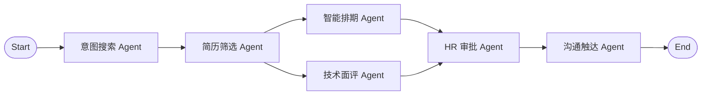

# ZhipinAgent

ZhipinAgent 是一个可以在 Windows 10/11 本地运行的多智能体招聘与简历挖掘系统。它使用 FastAPI + Uvicorn 提供本地后端 API，用 LangGraph StateGraph 编排 5 个 ReAct 风格招聘 Agent，把职位 JD 管理、简历解析、候选人匹配评分、面试排期、HR 审批、邮箱收件和通知触达整合到一个桌面工作台里，适合学习 AI Agent 工作流、验证招聘自动化原型，或作为本地优先的 HR 工具继续二次开发。

项目默认可以离线演示：不配置 LLM API Key、不配置邮箱，也能用内置样例 JD 和样例简历跑通完整流程。配置 OpenAI 兼容模型、硅基流动、IMAP 邮箱、SMTP 或飞书后，可以扩展为更接近真实招聘场景的工作流。

> 当前项目仍是开源原型，不建议直接用于处理真实候选人数据。使用前请先确认隐私、合规和数据安全要求。

## 你可以用它做什么

- 管理招聘职位和 JD。
- 上传或导入候选人简历。
- 从 Outlook、QQ 邮箱、163、Gmail 等 IMAP 邮箱自动收取简历附件。
- 解析 TXT、PDF、Word、图片等格式的简历。
- 使用“技能 60% + 经验 30% + 学历 10%”的权重给候选人评分。
- 根据岗位要求生成候选人推荐理由、缺失技能和面试重点。
- 通过 5 个 ReAct 风格业务 Agent 协作完成意图识别、简历筛选、智能排期、技术面评和沟通触达。
- 推荐可用面试时间，并生成面试安排记录。
- 生成候选人邮件、HR 汇总、技术面试简报等通知草稿。
- 在 Windows 桌面窗口中使用完整招聘工作台。

## 功能预览

桌面工作台包含这些页面：

- **仪表盘**：查看职位、候选人、今日面试、匹配成功率等核心指标。
- **职位管理**：创建职位、编辑 JD、维护招聘人数和职位状态。
- **候选人库**：上传简历、查看解析结果、管理候选人资料。
- **AI 筛选**：运行 5-Agent 招聘工作流，查看匹配评分和推荐理由。
- **面试安排**：查看推荐面试时间，生成面试确认记录。
- **数据报表**：查看招聘漏斗和候选人转化数据。
- **系统设置**：配置 LLM、邮箱收件、通知通道和本地数据目录。

## 工作流

核心工作流由 5 个 ReAct 风格业务 Agent 和 1 个 HR 审批门禁组成。五个核心 Agent 都是独立类，包含 `metadata`、工具依赖和统一的 `run(state)` 执行入口；执行时会记录 `Reason -> Action -> Tool -> Observation` 轨迹，便于调试和解释每个节点为什么调用对应工具、观察到了什么结果。



流程说明：

1. **意图搜索 Agent** 从 JD 中提取岗位名称、技能、经验、学历、地点和关键词。
2. **简历筛选 Agent** 读取本地上传、样例目录或邮箱导入的简历，并结构化候选人信息。
3. **匹配评分模块** 按技能、经验、学历计算综合得分。
4. **智能排期 Agent** 推荐可用面试时间，并做基础冲突检测。
5. **技术面评 Agent** 生成面试关注点、风险提示和问题建议。
6. **HR 审批 Agent** 控制候选人可见邮件是否允许发送。
7. **沟通触达 Agent** 生成收件确认、入围、拒信、面试邀请、技术简报和 HR 汇总。

其中 HR 审批节点作为安全门禁存在，不计入 5 个核心 ReAct Agent，避免候选人可见通知在未经确认时被真实发送。

## 技术栈

| 模块 | 技术 |
| --- | --- |
| Agent 编排 | LangGraph、LangChain、ReAct、本地 fallback runner |
| 数据结构 | Pydantic |
| LLM 接入 | Mock LLM、OpenAI 兼容接口、硅基流动 |
| 简历解析 | pypdf、python-docx、Pillow、pytesseract、规则抽取 |
| 邮箱收件 | IMAP、Python email 标准库 |
| 通知触达 | JSON outbox、SMTP、SendGrid、飞书 Webhook |
| 后端服务 | FastAPI、Uvicorn、旧版标准库 HTTP Server 兼容入口 |
| 前端界面 | HTML、CSS、Vanilla JavaScript |
| 桌面应用 | PyWebView |
| Windows 打包 | PyInstaller |
| 测试 | unittest |

## 安装方式

目前推荐通过源码运行。后续如果发布了 Windows 安装包，可以在 GitHub Releases 中下载 `ZhipinAgentSetup.exe`。

### 方式一：源码运行

适合开发者、学习者，或者想自己修改项目的人。

要求：

- Windows 10/11
- Python 3.11+
- Git

克隆项目：

```powershell
git clone https://github.com/libo14/zhipin-agent.git
cd zhipin-agent
```

创建虚拟环境：

```powershell
python -m venv .venv
.\.venv\Scripts\Activate.ps1
python -m pip install --upgrade pip
```

安装依赖：

```powershell
pip install -r requirements.txt
```

启动 Web 版：

```powershell
python fastapi_app.py
```

然后打开终端中显示的本地地址，通常是：

```text
http://127.0.0.1:8765
```

启动桌面版：

```powershell
python desktop_app.py
```

### 方式二：运行命令行演示

```powershell
python run_demo.py
```

该命令会使用内置样例 JD 和样例简历，跑通完整招聘流程，并在 `data/outbox/` 中生成通知草稿。

### 方式三：旧版标准库后端兼容入口

```powershell
python web_app.py
```

如果你需要验证旧版 HTTP Server，也可以运行该入口。新版本推荐使用 `fastapi_app.py`。

## 首次使用

1. 打开桌面工作台。
2. 进入“职位管理”，查看或修改样例 JD。
3. 进入“候选人库”，使用内置样例简历，或上传自己的测试简历。
4. 进入“AI 筛选”，确认本次筛选 JD、阈值和候选人范围。
5. 点击运行筛选，查看候选人评分、推荐理由和面试建议。
6. 如需邮箱导入，进入“系统设置”配置 IMAP 邮箱。

默认情况下，项目不会真实发送候选人邮件，只会生成本地 JSON 草稿，方便调试和审计。

## 可选配置

项目可以不配置任何 API 直接运行。下面配置只在你需要接入真实服务时使用。

### LLM

默认使用 Mock LLM：

```powershell
$env:LLM_PROVIDER="mock"
```

使用硅基流动：

```powershell
$env:LLM_PROVIDER="siliconflow"
$env:SILICONFLOW_API_KEY="your-api-key"
$env:LLM_MODEL="deepseek-ai/DeepSeek-V3"
$env:LLM_BASE_URL="https://api.siliconflow.cn/v1"
```

使用 OpenAI 兼容接口：

```powershell
$env:LLM_PROVIDER="openai"
$env:OPENAI_API_KEY="your-api-key"
$env:LLM_MODEL="gpt-4o-mini"
```

### 邮箱收件

邮箱收件 Agent 使用 IMAP。大多数邮箱需要先开启 IMAP，并使用授权码，而不是网页登录密码。

```powershell
$env:IMAP_PROVIDER="outlook"
$env:IMAP_HOST="imap-mail.outlook.com"
$env:IMAP_PORT="993"
$env:IMAP_USERNAME="hr@example.com"
$env:IMAP_PASSWORD="your-app-password"
$env:IMAP_FOLDER="INBOX"
$env:IMAP_SEARCH="UNSEEN"
$env:IMAP_MAX_MESSAGES="20"
$env:IMAP_SSL="true"
$env:IMAP_MARK_SEEN="false"
```

常用邮箱：

- Outlook：`imap-mail.outlook.com:993`
- QQ 邮箱：`imap.qq.com:993`
- 163 邮箱：`imap.163.com:993`
- Gmail：`imap.gmail.com:993`

### 通知通道

默认只生成 JSON 草稿：

```powershell
$env:NOTIFICATION_CHANNELS="json"
```

SMTP：

```powershell
$env:NOTIFICATION_CHANNELS="json,smtp"
$env:SMTP_HOST="smtp.example.com"
$env:SMTP_PORT="587"
$env:SMTP_USERNAME="your-user"
$env:SMTP_PASSWORD="your-password"
$env:SMTP_FROM_EMAIL="hr@example.com"
$env:SMTP_USE_TLS="true"
```

飞书：

```powershell
$env:NOTIFICATION_CHANNELS="json,feishu"
$env:FEISHU_WEBHOOK_URL="https://open.feishu.cn/open-apis/bot/v2/hook/xxxx"
```

SendGrid：

```powershell
$env:NOTIFICATION_CHANNELS="json,sendgrid"
$env:SENDGRID_API_KEY="your-sendgrid-key"
$env:SENDGRID_FROM_EMAIL="hr@example.com"
```

## 数据目录

| 路径 | 用途 | 是否建议提交到 Git |
| --- | --- | --- |
| `data/sample_job.txt` | 样例 JD | 是 |
| `data/resumes/*.txt` | 样例简历 | 是 |
| `data/jobs/` | 用户创建或修改的职位 | 否 |
| `data/web_uploads/` | 前端上传的真实简历 | 否 |
| `data/email_resumes/` | 邮箱导入的真实简历 | 否 |
| `data/outbox/` | 通知草稿和发送记录 | 否 |
| `data/interviews/` | 面试确认记录 | 否 |
| `data/checkpoints*.sqlite` | LangGraph checkpoint 数据库 | 否 |

`.gitignore` 已经默认忽略运行数据、真实简历、构建产物和密钥文件。请不要把真实候选人简历、邮箱授权码、API Key 或面试记录提交到公开仓库。

## Windows 打包

如果你想自己构建 Windows 桌面程序：

```powershell
pip install -r requirements.txt
pip install pyinstaller
.\packaging\windows\build_exe.ps1
```

生成安装包：

```powershell
.\packaging\windows\build_installer.ps1
```

构建产物默认在：

```text
dist/
```

构建产物不建议提交到源码仓库。如果要给普通用户下载安装，建议上传到 GitHub Releases。

## 测试

运行单元测试：

```powershell
python -m unittest discover tests
```

桌面启动烟测：

```powershell
python desktop_app.py --smoke
```

## 项目结构

```text
.
├── assets/                       # 应用图标
├── data/                         # 样例数据和本地运行数据
├── packaging/windows/            # Windows 打包与安装脚本
├── src/recruitment_agents/       # Agent、workflow、parser、scoring、tools
├── static/                       # 前端页面
├── tests/                        # 单元测试
├── desktop_app.py                # PyWebView 桌面入口
├── fastapi_app.py                # FastAPI 本地 HTTP API
├── web_app.py                    # 旧版标准库 HTTP API 兼容入口
├── run_demo.py                   # CLI 演示入口
├── requirements.txt
└── pyproject.toml
```

## 常见问题

### 不配置 API Key 可以运行吗？

可以。项目默认支持 Mock LLM 和本地规则逻辑，可以直接运行样例流程。

### 可以处理 PDF 简历吗？

可以。项目支持 PDF 文本提取。扫描版 PDF 或图片简历依赖 OCR 能力，效果取决于本机环境和图片质量。

### 会自动发送邮件给候选人吗？

默认不会。默认通知通道是 `json`，只会生成本地草稿。只有你主动配置 SMTP、SendGrid 或飞书等通道后，才会尝试真实投递。

### 可以直接下载 exe 安装吗？

如果仓库 Releases 页面发布了 `ZhipinAgentSetup.exe`，可以直接下载安装。否则请按“源码运行”方式启动。

### 这个项目适合生产使用吗？

目前更适合作为学习、演示和原型项目。生产使用前需要补充权限控制、数据加密、日志审计、候选人隐私合规、稳定的 OCR/LLM 服务和更完整的错误处理。

## 许可证

当前仓库尚未内置许可证文件。正式开源前建议添加 `LICENSE`，例如 MIT、Apache-2.0 或 GPL-3.0。

## 贡献

欢迎提交 issue、建议和 pull request。比较适合继续完善的方向：

- 加密保存邮箱授权配置。
- 接入真实 Google Calendar。
- 增强 OCR 和扫描版 PDF 解析。
- 支持自定义评分权重。
- 增加候选人去重和人才库搜索。
- 增加 GitHub Actions 自动测试。
