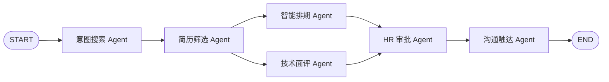

# ZhipinAgent

ZhipinAgent 是一个基于 LangChain 与 LangGraph 思路构建的多智能体招聘自动化系统。它把职位 JD 解析、简历读取、候选人评分、面试排期、HR 审批、邮件触达和桌面端工作台整合到一个可本地运行的应用中，适合用于 AI Agent 工作流学习、招聘自动化原型验证和桌面 AI 应用实践。

项目默认提供 Mock LLM 与本地规则解析能力，不接入任何第三方 API 也可以跑通演示流程；接入 OpenAI 兼容模型、硅基流动、SMTP、飞书、IMAP 邮箱后，可以进一步扩展为真实招聘工作流。

## 功能特性

- **5-Agent 招聘工作流**：意图搜索、简历筛选、智能排期、技术面评、进度沟通协同完成端到端招聘流程。
- **LangGraph 混合编排**：支持串行主流程与并行节点，安装 LangGraph 后优先使用 `StateGraph`，未安装时自动回退到本地 runner。
- **多格式简历解析**：支持 TXT、Markdown、PDF、Word 和图片 OCR 的简历读取。
- **加权人岗匹配**：按技能 60%、经验 30%、学历 10% 计算候选人综合评分。
- **可编辑 JD 筛选**：职位管理页可维护 JD，AI 筛选页可临时调整本次筛选 JD 并即时参与评分。
- **邮箱收件 Agent**：支持 Outlook、QQ 邮箱、163、Gmail 等 IMAP 邮箱，自动提取简历附件并导入候选人库。
- **桌面端工作台**：使用 PyWebView 封装本地 Web UI，可在 Windows 10/11 上作为桌面软件运行。
- **通知通道扩展**：默认输出 JSON 审计草稿，可接入 SMTP、SendGrid、飞书机器人。
- **HR 审批门禁**：候选人可见触达默认需要审批，避免未经确认的邮件直接发出。
- **Windows 打包脚本**：内置 EXE 与安装包构建脚本，方便生成本地桌面安装包。

## 项目预览

桌面工作台包含以下核心页面：

- 仪表盘：招聘指标、候选人匹配列表、AI 招聘助手、流程漏斗、今日待办。
- 职位管理：职位列表、JD 编辑器、岗位状态与 HC 管理。
- 候选人库：本地上传简历、邮箱收取简历、候选人结构化信息展示。
- AI 筛选：运行完整 Agent 工作流，查看意图解析、候选人评分、推荐理由。
- 面试安排：候选人可用时段推荐与面试确认记录。
- 数据报表：招聘漏斗与渠道表现。
- 系统设置：LLM、邮箱、通知通道和本地运行目录说明。

## 技术栈

| 模块 | 技术 |
| --- | --- |
| Agent 编排 | LangGraph、LangChain、本地 fallback runner |
| 数据建模 | Pydantic |
| LLM 接入 | Mock LLM、OpenAI 兼容接口、硅基流动 |
| 简历解析 | pypdf、python-docx、Pillow、pytesseract、规则抽取 |
| 邮箱收件 | IMAP、email 标准库、附件解析 |
| 通知触达 | JSON outbox、SMTP、SendGrid、飞书 Webhook |
| 面试排期 | Google Calendar API 风格 Tool、本地冲突检测 |
| Web 后端 | Python 标准库 HTTP Server |
| 前端 | HTML、CSS、Vanilla JavaScript |
| 桌面端 | PyWebView、PyInstaller |
| 测试 | unittest |

## 工作流架构



核心流程：

1. 意图搜索 Agent 从 JD 中提取岗位、技能、经验、学历、地点、关键词。
2. 简历筛选 Agent 读取本地、上传或邮箱导入的简历，并结构化候选人画像。
3. 匹配评分模块按技能、经验、学历进行加权打分。
4. 智能排期 Agent 生成可用面试时间并做冲突检测。
5. 技术面评 Agent 根据候选人与岗位差距生成面试重点。
6. HR 审批 Agent 控制候选人可见触达是否放行。
7. 沟通触达 Agent 输出收件、入围、拒信、面试邀请、技术简报、HR 汇总等通知。

## 快速开始

### 1. 克隆项目

```powershell
git clone https://github.com/libo14/zhipin-agent.git
cd zhipin-agent
```

### 2. 创建虚拟环境

```powershell
python -m venv .venv
.\.venv\Scripts\Activate.ps1
python -m pip install --upgrade pip
```

### 3. 安装依赖

```powershell
pip install -r requirements.txt
```

### 4. 运行命令行演示

```powershell
python run_demo.py
```

该命令会使用内置样例 JD 与样例简历跑通完整招聘工作流，并在 `data/outbox` 生成本地 JSON 通知草稿。

### 5. 启动 Web 工作台

```powershell
python web_app.py
```

启动后打开终端输出中的本地地址，通常是：

```text
http://127.0.0.1:8765
```

### 6. 启动桌面版

```powershell
python desktop_app.py
```

桌面版会自动启动本地 API 服务，并通过 PyWebView 打开应用窗口。

## Windows 打包

项目内置 Windows 打包脚本。打包前请确认已经安装依赖：

```powershell
pip install -r requirements.txt
pip install pyinstaller
```

生成桌面程序目录：

```powershell
.\packaging\windows\build_exe.ps1
```

生成安装包：

```powershell
.\packaging\windows\build_installer.ps1
```

安装包默认输出到：

```text
dist/installer/ZhipinAgentSetup.exe
```

> 注意：`build/`、`dist/`、`*.spec` 都是构建产物，已经被 `.gitignore` 忽略，不建议提交到 GitHub。

## 环境变量

复制示例配置：

```powershell
Copy-Item .env.example .env
```

### LLM 配置

默认使用 Mock LLM：

```powershell
$env:LLM_PROVIDER="mock"
```

使用硅基流动：

```powershell
$env:LLM_PROVIDER="siliconflow"
$env:SILICONFLOW_API_KEY="your-api-key"
$env:LLM_MODEL="deepseek-ai/DeepSeek-V3"
$env:LLM_BASE_URL="https://api.siliconflow.cn/v1"
```

使用 OpenAI 兼容接口：

```powershell
$env:LLM_PROVIDER="openai"
$env:OPENAI_API_KEY="your-api-key"
$env:LLM_MODEL="gpt-4o-mini"
```

### 邮箱收件配置

支持通过 IMAP 收取邮件附件中的简历。多数邮箱需要先在邮箱设置中开启 IMAP，并使用授权码而不是登录密码。

```powershell
$env:IMAP_PROVIDER="outlook"
$env:IMAP_HOST="imap-mail.outlook.com"
$env:IMAP_PORT="993"
$env:IMAP_USERNAME="hr@example.com"
$env:IMAP_PASSWORD="your-app-password"
$env:IMAP_FOLDER="INBOX"
$env:IMAP_SEARCH="UNSEEN"
$env:IMAP_MAX_MESSAGES="20"
$env:IMAP_SSL="true"
$env:IMAP_MARK_SEEN="false"
```

常用 provider：

- `outlook`：`imap-mail.outlook.com:993`
- `qq`：`imap.qq.com:993`
- `163`：`imap.163.com:993`
- `gmail`：`imap.gmail.com:993`

### 通知通道配置

默认只写 JSON 草稿：

```powershell
$env:NOTIFICATION_CHANNELS="json"
```

SMTP：

```powershell
$env:NOTIFICATION_CHANNELS="json,smtp"
$env:SMTP_HOST="smtp.example.com"
$env:SMTP_PORT="587"
$env:SMTP_USERNAME="your-user"
$env:SMTP_PASSWORD="your-password"
$env:SMTP_FROM_EMAIL="hr@example.com"
$env:SMTP_USE_TLS="true"
```

飞书：

```powershell
$env:NOTIFICATION_CHANNELS="json,feishu"
$env:FEISHU_WEBHOOK_URL="https://open.feishu.cn/open-apis/bot/v2/hook/xxxx"
```

SendGrid：

```powershell
$env:NOTIFICATION_CHANNELS="json,sendgrid"
$env:SENDGRID_API_KEY="your-sendgrid-key"
$env:SENDGRID_FROM_EMAIL="hr@example.com"
$env:SENDGRID_BASE_URL="https://api.sendgrid.com"
```

## 数据目录

| 路径 | 说明 | 是否建议提交 |
| --- | --- | --- |
| `data/sample_job.txt` | 示例 JD | 是 |
| `data/resumes/*.txt` | 示例简历 | 是 |
| `data/jobs/` | 用户创建或修改的职位 | 否 |
| `data/web_uploads/` | 前端上传的真实简历 | 否 |
| `data/email_resumes/` | 邮箱导入的真实简历 | 否 |
| `data/outbox/` | 通知草稿与投递记录 | 否 |
| `data/interviews/` | 面试确认记录 | 否 |
| `data/checkpoints*.sqlite` | LangGraph checkpoint 数据库 | 否 |

开源前请务必确认真实简历、邮箱授权码、候选人联系方式、面试记录、发件草稿没有进入 Git 历史。

## 运行测试

```powershell
python -m unittest discover tests
```

桌面启动烟测：

```powershell
python desktop_app.py --smoke
```

构建后 EXE 烟测：

```powershell
.\dist\ZhipinAgent\ZhipinAgent.exe --smoke
```

## 目录结构

```text
.
├── data/                         # 示例数据与本地运行数据
├── packaging/windows/            # Windows 打包与安装脚本
├── src/recruitment_agents/       # Agent、workflow、parser、scoring、tool
│   ├── agents.py                 # 各招聘 Agent 节点
│   ├── workflow.py               # LangGraph 编排与 fallback runner
│   ├── parsers.py                # 简历解析
│   ├── scoring.py                # 加权评分
│   └── tools/                    # 邮箱、排期、通知工具
├── static/                       # 桌面工作台前端
├── tests/                        # 单元测试
├── desktop_app.py                # PyWebView 桌面入口
├── web_app.py                    # 本地 HTTP API
├── run_demo.py                   # CLI 演示入口
├── requirements.txt
└── pyproject.toml
```

## 开源发布清单

发布到 GitHub 前建议执行：

```powershell
python -m unittest discover tests
python desktop_app.py --smoke
```

检查以下内容：

- `.env`、API Key、邮箱授权码未提交。
- `data/web_uploads/`、`data/email_resumes/`、`data/outbox/`、`data/interviews/` 未提交。
- `build/`、`dist/`、`*.spec` 未提交。
- README 中的 GitHub 地址、截图、许可证信息已经替换为你的真实项目内容。
- 如需开源分发，补充 `LICENSE` 文件。

## 路线图

- 加密保存邮箱账号配置，避免每次启动重新填写授权码。
- 接入真实 Google Calendar，完成候选人与面试官日程双向同步。
- 增加更强的 OCR 与简历结构化模型，提升扫描版 PDF 解析质量。
- 增加可配置评分权重与岗位画像模板。
- 增加多租户职位库、候选人去重、招聘渠道追踪。
- 增加 Docker 部署方式和 CI 测试流水线。

## 许可证

当前仓库尚未内置许可证文件。正式开源前建议选择并添加 `LICENSE`，例如 MIT、Apache-2.0 或 GPL-3.0。
